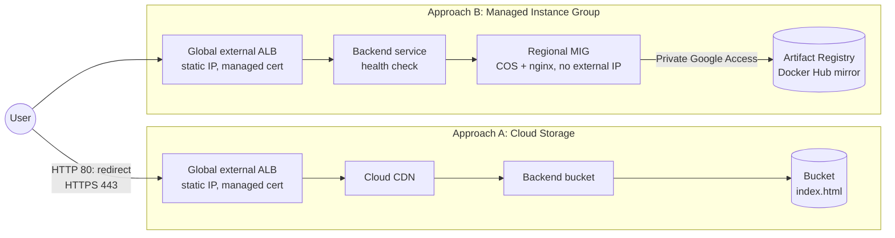

# Website Hosting on Google Cloud with Terraform

Two ways to host a website on Google Cloud, defined entirely with Terraform and delivered through CI/CD.
Every change goes through a pull request: GitHub Actions validates and plans it, deploys it to `dev`, and promotes the same commit to `prod` after approval.
Each environment lives in its own Google Cloud project.

| Environment | Cloud Storage + Cloud CDN | Managed Instance Group |
|---|---|---|
| dev | https://136-82-66-186.sslip.io | https://136-82-81-140.sslip.io |
| prod | https://136-81-35-223.sslip.io | https://136-81-34-194.sslip.io |

Each page shows its environment and hosting approach.
Every architectural decision is recorded in [`docs/adr/`](docs/adr/README.md).

## Architecture



Both approaches share the same load balancer module: a reserved global IP, a Google-managed certificate, a TLS 1.2+ policy, and a permanent HTTP to HTTPS redirect.

## The two approaches

### A. Cloud Storage behind a global external Application Load Balancer

This is the canonical way to serve static content on Google Cloud.
There is no server to patch, it scales without configuration, and its marginal cost is close to zero.
A change to the HTML changes the object content, so Terraform uploads it again.
The page is served with `Cache-Control: no-cache`, so the CDN revalidates it and a redeployment is visible immediately.

### B. Managed Instance Group behind a global external Application Load Balancer

This shows compute-based hosting, where the machine type, the instance count, and the zones are parameters.
VMs run Container-Optimized OS with an unprivileged nginx container pinned by digest, on a read-only filesystem without Linux capabilities.
They have no external IP, no NAT, and no SSH, and they pull the image from an Artifact Registry mirror of Docker Hub through Private Google Access.
The HTML is part of the instance template, so a change creates a new template, and the MIG replaces instances with a surge-first rolling update without downtime.
Terraform returns only when every instance runs the new template.

### Comparison

| | A. Cloud Storage | B. Managed Instance Group |
|---|---|---|
| Operations | None | Image pinning, health checks, rolling updates |
| Redeployment | Object upload, instantaneous | New template, rolling update in minutes |
| Scaling | Automatic | Instance count per environment |
| Dynamic content | Not possible | Possible |
| Monthly cost per project | About USD 18 | About USD 18 + USD 7 per VM |
| Choose it when | The site is static | The site needs a server, or VMs are a constraint |

For a static site, approach A is the one to run in production.

### Rejected options

| Option | Reason |
|---|---|
| Cloud Run | A strong production choice, but it needs an image build pipeline to serve one HTML file. It is the natural next step if the site becomes dynamic. |
| Firebase Hosting | Hides the underlying infrastructure, and its Terraform support is partial and beta-only. |
| App Engine | One application per project, a region that cannot change, and little new investment in the platform. |
| GKE | Cost and operational overhead out of proportion for static content. |
| Cloud Functions | Built for event-driven code, not for serving static content. |
| VMs with `apt install nginx` and Cloud NAT | Slow and non-reproducible boot, and internet egress the site does not need. |

Details: [ADR 0002](docs/adr/0002-hosting-approaches.md) and [ADR 0006](docs/adr/0006-mig-runtime.md).

## Design properties

| Property | Implementation |
|---|---|
| Everything as code, `google` and `google-beta` | Everything is Terraform, including APIs, identities, and the state bucket. Both providers are declared and configured in every root module ([ADR 0010](docs/adr/0010-provider-usage.md)). |
| Remote state | One Cloud Storage bucket per project, with versioning and soft delete ([ADR 0004](docs/adr/0004-remote-state-per-project.md)). |
| Continuous delivery | A merged change to `site/**` is applied by CI to both stacks, `dev` first and then `prod`; the object or the instance template changes with the HTML. |
| Stable endpoint | IPs are reserved in the foundation layer, so they survive redeployments and even a destroy of a stack ([ADR 0007](docs/adr/0007-stable-endpoint-and-tls.md)). |
| TLS | Google-managed certificates for `<ip>.sslip.io`, or for any domain given in `domain`. |
| Isolated environments with their own parameters | `envs/dev` and `envs/prod` set the project, zones, instance count, and budget ([ADR 0005](docs/adr/0005-environment-parameterization.md)). |
| Keyless CI/CD | GitHub Actions with Workload Identity Federation and no service account keys ([ADR 0008](docs/adr/0008-ci-github-actions-wif.md)). |

## Repository layout

```
foundation/      Per-project base layer, applied by a human: APIs, state bucket, network,
                 static IPs, Artifact Registry mirror, identities, Workload Identity, budget
modules/
  https-lb/      Global external ALB: static IP, managed certificate, TLS policy, redirect
  site-gcs/      Bucket, index object, backend bucket with Cloud CDN
  site-mig/      Hardened instance template, regional MIG, health check, backend service
stacks/
  gcs/           Approach A: site-gcs + https-lb, deployed by CI
  mig/           Approach B: site-mig + https-lb, deployed by CI
envs/<env>/      common.tfvars, <stack>.tfvars, backend.gcs.tfbackend
site/            index.html template
scripts/         Smoke test used by CI and locally
docs/adr/        Architecture decision records
```

The layers have different lifecycles and different operators ([ADR 0003](docs/adr/0003-layered-configuration.md)).
The foundation holds identities, IAM, and the network, so the CI identity never needs to manage them.
Stacks read the foundation outputs through `terraform_remote_state`.

## Security

- No keys: CI authenticates with Workload Identity Federation and short-lived tokens.
- The Workload Identity provider accepts only tokens of this repository, matched by its immutable numeric ID.
- Bindings use GitHub immutable subject claims, so a repository recreated under the same name gets no access.
- The apply identity of an environment only trusts jobs running in the matching GitHub Environment; `prod` requires a manual approval.
- Pull request plans use a read-only identity, and forks never receive credentials.
- The CI identity can manage compute, load balancing, and storage, but cannot create identities, change project IAM, or change the network ([ADR 0009](docs/adr/0009-least-privilege-iam.md)).
- VMs run with a dedicated service account, Shielded VM, blocked project SSH keys, and no external IP.
- Actions are pinned by commit SHA and container images by digest.
- gitleaks runs in a pre-commit hook and over the full history in CI; trivy scans the Terraform code.
- `main` is protected: changes only land through pull requests with passing checks.

Accepted exceptions are documented next to the code: Google-managed encryption instead of customer-managed keys, and public read on the site bucket, which the backend bucket requires.

## Cost

List prices for `us-central1`, from the Cloud Billing Catalog API in September 2026, for 730 hours a month.

| Item | Unit price | dev | prod |
|---|---|---|---|
| Forwarding rules (first 5 in a project, shared by both stacks) | USD 0.025 per hour | 18.25 | 18.25 |
| e2-micro instance | USD 0.0084 per hour | 6.12 | 12.24 |
| Balanced persistent disk, 10 GiB per VM | USD 0.10 per GiB per month | 1.00 | 2.00 |
| Load balancer data processing, Cloud CDN, storage, logs | Per GiB | < 1 | < 1 |
| **Total per month** | | **about USD 26** | **about USD 33** |

- Approach A alone costs about USD 18 per project: the load balancer is the whole cost.
- Approach B adds about USD 7 per VM.
- One e2-micro per billing account is covered by the Compute Engine free tier.
- A budget alert per project warns at 50%, 90%, and 100% of a monthly amount.
- A reserved IP that is not in use costs about USD 7 per month, which only happens when a stack is destroyed while the foundation remains.

## Deploy

### Prerequisites

- Two Google Cloud projects with billing enabled, for example one for `dev` and one for `prod`.
- `gcloud`, Terraform 1.10 or later, and `make`.
- Application Default Credentials of a user who owns both projects: `gcloud auth application-default login`.

### 1. Configure the environments

For each environment in `envs/<env>/`:

- `common.tfvars`: set `project_id`.
- `backend.gcs.tfbackend`: set `bucket` to `<project_id>-tfstate`.
- `foundation.tfvars`: set the GitHub repository and its IDs, from `gh api repos/<owner>/<repo> --jq '{id, owner_id: .owner.id}'`.

### 2. Bootstrap the foundation, once per project

```sh
export TF_VAR_billing_account=XXXXXX-XXXXXX-XXXXXX   # optional: creates the budget alert
make bootstrap ENV=dev
make bootstrap ENV=prod
```

The first apply uses a local state, because the state bucket does not exist yet; the target then migrates the state into the new bucket.
Later foundation changes use `make plan` and `make apply` with `STACK=foundation`.

### 3. Deploy the sites

Through CI, which is the normal path:

1. Set the repository variables `DEV_PROJECT_ID`, `PROD_PROJECT_ID`, `DEV_WORKLOAD_IDENTITY_PROVIDER`, and `PROD_WORKLOAD_IDENTITY_PROVIDER` from the foundation output `workload_identity_provider`.
2. Create the GitHub Environments `dev` and `prod`, and require a reviewer on `prod`.
3. Merge to `main`: `dev` deploys, then `prod` waits for approval.

Locally, for a first try:

```sh
make apply ENV=dev STACK=gcs
make apply ENV=dev STACK=mig
make smoke-test ENV=dev STACK=gcs
```

A new certificate takes 10 to 20 minutes to become active; HTTP answers with a redirect meanwhile.
Run `make help` for every target.

### 4. Destroy

Stacks first, then the foundation, for each environment:

```sh
make destroy ENV=dev STACK=gcs
make destroy ENV=dev STACK=mig
make teardown ENV=dev
```

`make teardown` mirrors the bootstrap: it refuses to run while a stack still has resources, moves the foundation state back to a local backend, and only then allows the state bucket to be deleted with its content.
A deleted Workload Identity pool keeps its ID reserved for 30 days, so bootstrapping the same project again within that period requires restoring the pool with `gcloud iam workload-identity-pools undelete`.

## CI/CD

```
pull request ──> gitleaks, fmt, validate, terraform test, tflint, trivy
             └─> plan {dev, prod} x {gcs, mig} with the read-only identity
merge to main ─> apply dev (gcs, mig) ─> smoke test
             └─> approval ─> apply prod (gcs, mig) ─> smoke test
```

`prod` always receives the exact commit that was validated in `dev`, through the same reusable workflow.
To roll back, revert the change and merge: the pipeline is the same.

## Trade-offs and next steps

- **One region for both environments**, on purpose, for parity: what passes in `dev` behaves the same in `prod`.
- **Only CI applies stacks, by convention.** The owner of a personal project can still apply locally; in an organization, humans would get read-only access and a break-glass role, and a scheduled plan would detect drift.
- **The foundation is applied by a human.** In a larger setup it would get its own pipeline, in an admin project, with a stricter approval.
- **sslip.io instead of a real domain.** A registered domain with Cloud DNS is a one-variable change.
- Not implemented to keep the cost low: Cloud Armor, customer-managed encryption keys, and uptime checks.
